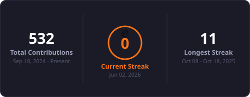

<div align="center">
  
</div>

<div align="center">
  
</div>

<br/>

<div align="center">
  <a href="https://www.linkedin.com/in/sparsh-joshi-8673a5319">
    
  </a>
  <a href="https://github.com/Sparshjoshi-iit">
    
  </a>
  <a href="https://www.iitmandi.ac.in">
    
  </a>
</div>

---

## 🙋‍♂️ About Me

```python
class SparshJoshi:
    def __init__(self):
        self.name        = "Sparsh Joshi"
        self.institute   = "IIT"
        self.roles       = ["BTech @ IIT Mandi", "ML Enthusiast", "GenAI Builder", "Open Source Contributor"]
        self.research    = ["Computer Vision", "NLP", "Generative AI", "MLOps"]
        self.building    = ["RAG Pipelines", "Fine-tuned LLMs", "CV Systems", "AI Agents"]
        self.frameworks  = ["PyTorch", "TensorFlow", "HuggingFace", "LangChain"]
        self.philosophy  = "Bridge the gap between research papers and production systems"
        self.fun_fact    = "I read arxiv papers the way others read the news 📄"

    def say_hi(self):
        print("Thanks for stopping by! Let's push the frontier together 🚀")

me = SparshJoshi()
me.say_hi()
```

<br/>

<table>
  <tr>
    <td>🧠</td>
    <td>Deep interest in <strong>LLMs, RAG, Diffusion Models</strong> and <strong>Agentic AI</strong></td>
  </tr>
  <tr>
    <td>🔬</td>
    <td>Working on <strong>Computer Vision</strong> and <strong>NLP</strong> — from research to deployment</td>
  </tr>
  <tr>
    <td>🤗</td>
    <td>Active with <strong>HuggingFace</strong>, open-source tools and the broader ML community</td>
  </tr>
  <tr>
    <td>📐</td>
    <td>Obsessed with <strong>MLOps</strong> — clean pipelines, reproducible experiments, tracked metrics</td>
  </tr>
  <tr>
    <td>📄</td>
    <td>Love reading and implementing <strong>research papers</strong> — from arxiv to working code</td>
  </tr>
  <tr>
    <td>📫</td>
    <td>Reach me on <a href="https://www.linkedin.com/in/sparsh-joshi-8673a5319">LinkedIn</a></td>
  </tr>
</table>

---

## 💻 Tech Stack

<details open>
<summary><b>🧠 ML / DL / GenAI</b></summary>
<br/>


</details>

<details open>
<summary><b>⚙️ Backend, APIs & Infra</b></summary>
<br/>


</details>

---

## 🤖 ML / DL Focus Areas

<div align="center">

| 🔭 Domain | 🛠️ What I Work On |
|---|---|
| **Generative AI** | LLM fine-tuning, RAG pipelines, prompt engineering, AI agents |
| **Computer Vision** | Object detection, segmentation, image classification, OpenCV |
| **NLP** | Text classification, transformers, embeddings, semantic search |
| **MLOps** | Experiment tracking (MLflow), model serving, CI/CD for ML |
| **Deep Learning** | CNNs, RNNs, Transformers, GANs, Diffusion Models |

</div>

---

## 📊 GitHub Stats

<div align="center">

<!-- CONTRIBUTIONS_BADGE -->

<!-- /CONTRIBUTIONS_BADGE -->


<br/>



</div>

---

## 🏆 GitHub Trophies

<div align="center">


</div>

---

## ✍️ Random Dev Quote

<div align="center">


</div>

---

<div align="center">
  
</div>
